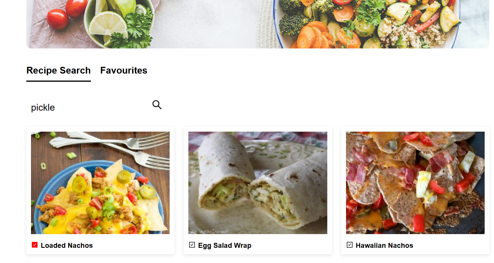
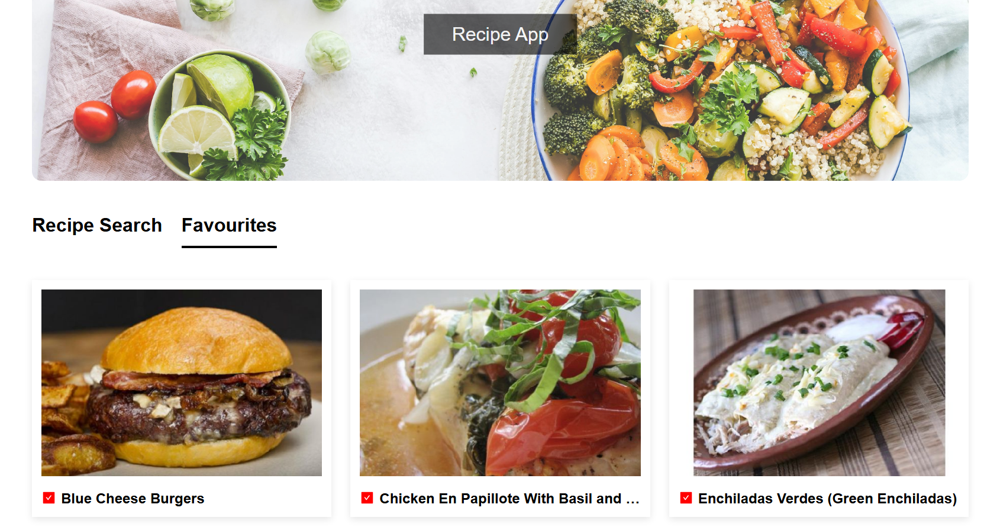

#Fullstack Recipe Macros App 

#Description 
This App lets users view,add, and manage their recipes macros. It is built with react on the front end and node.js + prisma for the backend. 
It uses neon.tech for the database and spoonacular API to get the recipe information. 

#Features
-Has a responsive and interactive UI 
-Search for recipes by keyword or ingredient
-Favorite recipes and store them in a database
-View and manage favorited recipes
-Display recipe macros, including ingredients and nutritional information 

#Set up and Installation 
-Clone the repository 'https://github.com/ostenoe/Recipe-app.git'
-install dependencies 'npm install'
-set up database 'psql -U your-username -d recipe_finder -f schema.sql'
-start the backend 'npm start'
-start the frontend 'npm run dev'

#Screenshots
 

#Acknowledgements
-Node.js for the backend runtime
-Express for the web framework  

